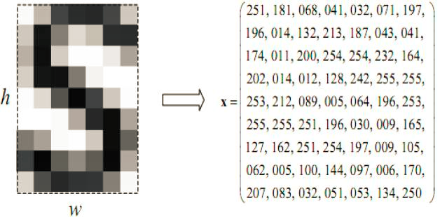

# Atelier IA : Classification de chiffres manuscrits

## Introduction

L'IA peut permettre de résoudre de nombreux problèmes complexes que l'informatique traditionnelle peine à traiter.

Ici, notre problème est l'analyse de chiffres manuscrits. Comment obtenir un programme capable de "deviner" à quel chiffre correspond une image de chiffre dessiné par un utilisateur comme ceci ?

De nos jours, avec la forte puissance de calcul des ordinateurs et toutes les ressources gratuites et libres qui existent, le *machine learning* et plus particulièrement le *deep learning* avec ses réseaux de neurones profonds est particulièrement adapté à résoudre ce type de problème sur des images.

Pour un ordinateur, les images en noir et blanc ne sont que des tableaux de valeurs (matrices) où chaque case représente un pixel allant de 0 (noir pur) à 255 (blanc pur).

Par le jeu d'algorithmes mathématiques que nous allons implémenter en python, l'ordinateur va pouvoir "apprendre" à déceler des motifs sur ces pixels et comprendre les images c'est-à-dire en extraire du sens. C'est de cette façon qu'une machine peut "voir".

L'idée est d'entraîner un modèle d'IA avec ce type d'images de chiffres manuscrits étiquetés. On appelle cela l'apprentissage supervisé car l'algorithme dispose à la fois des questions (les dessins de chiffres) et des réponses  (les entiers correspondants) lors de son apprentissage.

Pour ce projet, nous allons procéder en 3 grandes étapes :

    1) Récupérer et préparer la donnée

    2) Entraîner le modèle avec cette donnée

    3) Réaliser une interface graphique branchée sur notre modèle
    
## Préparation

Avant d'attaquer ces étapes, commençons par nous assurer que tout ce dont nous avons besoin est installé sur notre ordinateur. En ouvrant l'invite de commandes (soit directement, soit avec la plateforme où vous avez installé Python, comme Anaconda), commencez par vérifier les programmes, puis à les installer ou les mettre à jours si nécessaires. L'outil privilégié ici est l'installateur PyPi, ou ``pip``.

Vous pouvez voir toutes les librairies déja installées et leur version avec ``pip list``.

Les librairies dont nous aurons besoin :

* La libraire **Pandas**, pour l'utilisation de tableaux DataFrames : ``pip show pandas`` pour vérifier sa présence, ``pip install --update pandas`` pour l'installer.

* Le package d'affichage de graphiques **Pyplot** de **Matplotlib**, avec ``pip show matplotlib`` / ``python -m pip install --upgrade matplotlib``.

* La librairie **Scikit-Learn** ou ``sklearn``, remplie de packages adaptés au *machine learning*, avec ``pip show sklearn`` / ``pip install --upgrade scikit-learn``.

* La librairie de traitement d'images **OpenCV** ou ``cv2`` : ``pip show opencv-python`` / ``pip3 install --upgrade opencv-python``.

* La librairie d'entraînement de modèles **Tensorflow**, qui intègre en plus l'autre librairie **Keras** : ``pip show tensorflow`` / ``pip install --upgrade tensorflow``.

* La librairie d'utilisation de **Google-Colab** :

* Une autre librairie de traitement d'images, **Pillow** ou **PIL** : ``pip show Pillow`` / ``pip install --upgrade Pillow``.

Nous utiliserons également le module d'affichage **Tkinter** fourni avec la version de base de Python.

Nous pouvons ensuite passer à l'étape suivante. Téléchargez et ouvrez [le Notebook Jupyter présent ici.](1_modele.ipynb)
